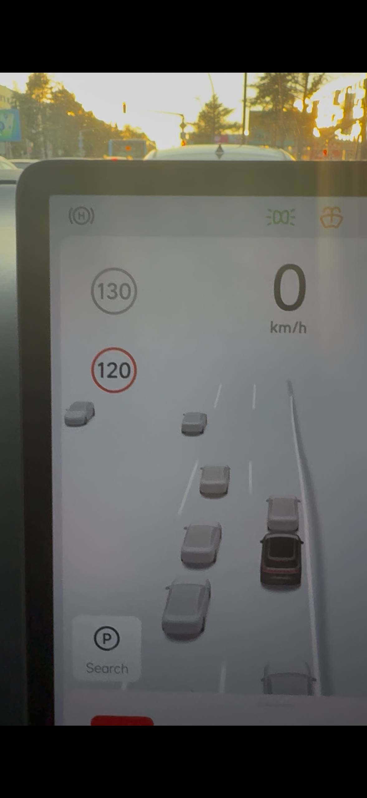

# ProUnbound

Приложение для подмены GPS-координат, предназначенное для снятия ограничения
скорости **ACC/LCC в 100 км/ч** на Lixiang серии PRO. Подмена запускается одной
кнопкой и автоматически отключается через 30 секунд.

**Проверено только на PRO без лидара, 2024 года выпуска, с прошивкой 8.6.**
Работа на других моделях и версиях прошивки не проверялась.

## Установка

Установите `ProUnbound.apk` любым доступным вам способом: через **ADB**,
**CarModApps** или **LiApp Store**.

После установки откройте ProUnbound и разрешите доступ к местоположению,
если появится запрос.

## Настройка фиктивного местоположения

1. Откройте **Developer Options / Для разработчиков** в настройках Android
   мультимедийной системы.
2. Найдите **Select mock location app / Выбрать приложение для фиктивных
   местоположений** и выберите **ProUnbound**.
3. Убедитесь, что геолокация включена, и вернитесь в ProUnbound.

В Developer Options выбирается приложение, а не вводятся координаты вручную:
ProUnbound передаёт их автоматически.

## Запуск

Нажмите **Запуск**, когда **LCC/ACC доступны для включения**.
Через 30 секунд подмена отключится автоматически; кнопка **Остановить**
позволяет завершить её раньше.

## Нюансы

- При включении **LCC** автомобиль сразу стремится разогнаться до максимальной
  скорости круиз-контроля — **130 км/ч**.
- На дисплее постоянно отображается ограничение **120 км/ч**, независимо от того,
  где вы едете.
- Автомобиль перестаёт распознавать светофоры.

Эти эффекты сохраняются до выхода из автомобиля и повторного входа в него.

*Ограничение 120 км/ч и скорость круиз-контроля 130 км/ч на дисплее автомобиля.*

Если раздел Developer Options скрыт, сначала включите его. На стандартном
Android для этого нажимают **Номер сборки / Build number** семь раз в разделе
информации об устройстве. На автомобильной прошивке способ доступа и названия
пунктов могут отличаться. [Справка Android](https://developer.android.com/studio/debug/dev-options).
